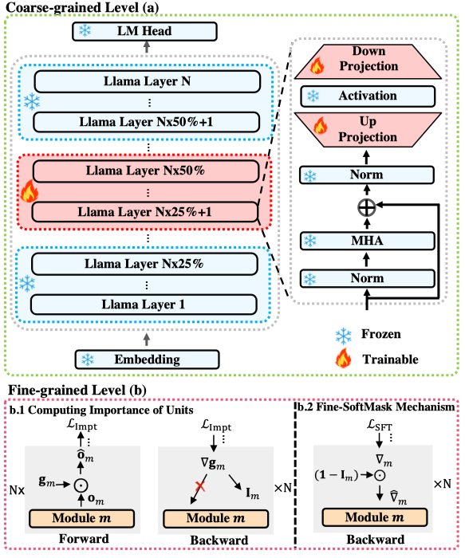

# Balancing Speciality and Versatility: A Coarse to Fine Framework for Supervised Fine-tuning Large Language Model
This is the code repository of "Balancing Speciality and Versatility: A Coarse to Fine Framework for Supervised Fine-tuning Large Language Model"


# 🚀 Introduction

To enhance the speciality through supervised fine-tuning, while preserving its versatility, we propose a coarse to fine framework called *CoFiTune*.
The *CoFiTune* train specific modules within a defined layer range at the coarse level and utilizes a fine-grained soft-masking mechanism to further prevent CF in versatility without harming the speciality.



## 📄 Get Started

## 📝 Setup

```
conda env create -n llm python==3.11 -y

conda activate llm

pip install -r requirements.txt

# important package
deepspeed==0.9.2
accelerate==0.19.0
bitsandbytes==0.41.1
ninja==1.11.1
```

- Noted that, you need to replace the original stage3.py in `site-packages/deepspeed/runtime/zero/stage3.py` with ours modified version in `setup/stage3.py` to apply the fine-grained soft-masking mechanism in deepspeed zero3 training strategy.

## 💻 Models
- Following the instructions from [Chinese-LLaMA-Alpaca](https://github.com/ymcui/Chinese-LLaMA-Alpaca/wiki/%E6%89%8B%E5%8A%A8%E6%A8%A1%E5%9E%8B%E5%90%88%E5%B9%B6%E4%B8%8E%E8%BD%AC%E6%8D%A2) to download the LLMs.

## 📥 Data
- Math dataset can be collected from [MathOctopus](https://github.com/microsoft/MathOctopus/tree/main), the extracted Chinese version can be found in `data/math` directory 
- Finance dataset can be collected from [FiQA](https://huggingface.co/datasets/FinGPT/fingpt-fiqa_qa), the sample data constructed by us can be found in `data/finance` directory
- CAG dataset can be collected from [Dureader-2.0](https://github.com/baidu/DuReader/tree/master/DuReader-2.0)
- Law dataset can be collected from [lawyer-llama](https://github.com/AndrewZhe/lawyer-llama)


## ⛳️ Run
- Our code is based on a SLURM platform, you can flexibly modify your code to adapt to your own computing environment.

### Computing the Importance Vector of Module
- If you decide to use the fine-grained soft-masking mechanism, you need to first compute the importance vector of modules. Change the variable in `compute_impt_vector.sh`, the important variables are as follows: 

```shell
#! model path
declare -A model_dict
model_dict["7b"]="path/to/7b-model/"
model_dict["13b"]="path/to/13b-model/"
model_dict["33b"]="path/to/33b-model/"

#! load pretrained model
MODEL_NAME="model_name" 
LOAD_PATH=${model_dict["${MODEL_NAME}"]}
TOKEN_PATH=${LOAD_PATH}

#! train dataset config path
declare -A data_dict
data_dict["train-dataset-name"]="xxx/train_data_config.json"

TRAIN_DATA_NAME=xxx
DATA_PATH=${data_dict[${TRAIN_DATA_NAME}]}
BATCH_SIZE=16
```
- set the path of your model and training data to the `model_dict` and `data_dict`, an example of `train_data_config.json` is as follows:

```json
{
    "data_paths": [
        "/path/to/train.jsonl"
    ],
    "data_output_dir": "tmp_data/",
    "train_proportion": 1.0,
    "eval_proportion": 0,
    "max_seq_len": 512
}
```

- each line in train.jsonl is a dict: `{'instruction':xxx, 'input':xxx, 'output':xxx}`


### Training

```shell
declare -A train_layers_7B
### 7B train layers
train_layers_7B['bottom1']='0,1,2,3,4,5,6,7'
train_layers_7B['bottom2']='8,9,10,11,12,13,14,15'
train_layers_7B['bottom-plus']='0,1,2,3,4,5,6,7,8,9,10,11,12,13,14,15'
train_layers_7B['middle']='16,17,18,19,20,21,22,23'
train_layers_7B['middle-plus']='8,9,10,11,12,13,14,15,16,17,18,19,20,21,22,23'
train_layers_7B['top']='24,25,26,27,28,29,30,31'
train_layers_7B['top-plus']='16,17,18,19,20,21,22,23,24,25,26,27,28,29,30,31'
train_layers_7B['None']='None'


#! efficient train param
TRAIN_LAYER=bottom2 #! bottom, middle, top, None ..
OPTIMIZE_LAYERS=${train_layers["${TRAIN_LAYER}"]} 
OPTIMIZE_PARAMS=up_proj,down_proj #q_proj,k_proj,v_proj,up_proj,down_proj


#! fine-grained softmask
TRAIN_WITH_SOFTMASK=True #! True or False
APPLY_SOFTMASK=input_projection,output_projection
```
- Select the layer range for training in `train_layers_#B` using the variable `TRAIN_LAYER`. Use 'None' to train all layers. Choose the specific modules to train within the `TRAIN_LAYER` using the variable `OPTIMIZE_PARAMS`.
- training will exclusively occur in the coarse level manner. However, if you set `TRAIN_WITH_SOFTMASK` to True and designate specific modules in `APPLY_SOFTMASK` where fine-grained soft-masking should be applied, the model will utilize fine-grained SoftMask in those specified modules.
- Before training, you need to change the prompt template of your own LLM in `src/training.py`

